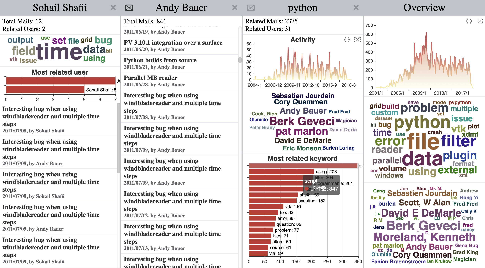

# Visualizaton of the ParaView Mailing List



## How to make this into a webpage
1. Download all the dependencies

  ```
  npm i
  ```

1. Build data in `dist/` folder
  Execute the following commands consecutively
  ```
  mkdir dist
  node build/intialize.js
  ```
3. Pack everything up

  ```
  node build/bundle.js
  ```
4. Open `out/index.html` in browser